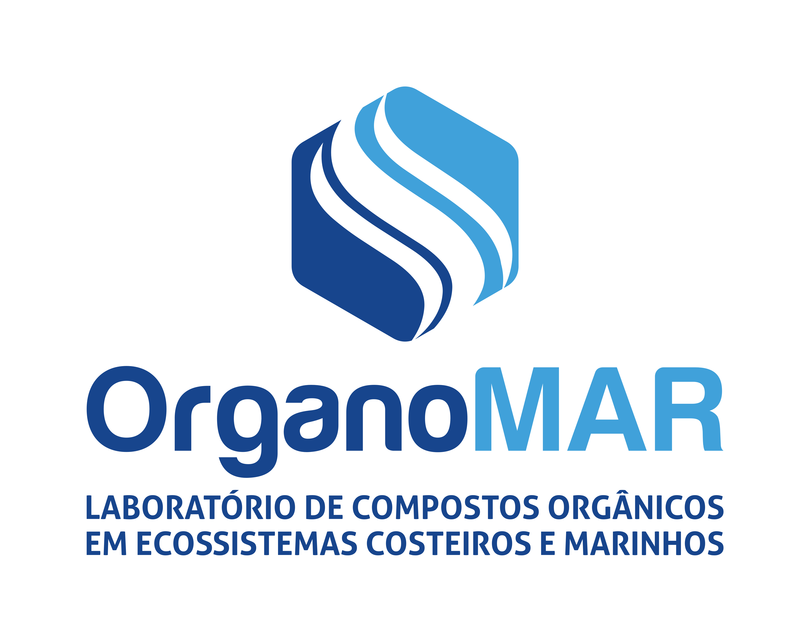

<a href="https://www.ufpe.br/organomar">https://www.ufpe.br/organomar</a>

 
 

<strong>DOI</strong>: <a href="endereço">endereço</a>

# Introduction
>>
>>
This repository was created to support the manuscript "<em>Two Decades of Sedimentation and Contemporary Urban Contamination in Brazilian Tropical Coastal Reefs</em>". The manuscript was submitted to <a href="https://www.sciencedirect.com/journal/marine-pollution-bulletin"> Marine Pollution Bulletin</a> by Thales J. Vidala1*, Bruno V. M. da Costaa2, Eduardo C. de Macêdob3, Eliete Zanardi-Lamardoa4, Rodrigo F. Bastosc5, Roxanny H. de Arruda-Santosa6, Nelson A. Gouveiaa7, Mauro Maidaa8, Marius N. Mullera9, Roberto L. Barcellosa10, Manuel J. Flores-Montesa11, André L. S. Camposa12, Beatrice P. Ferreiraa13.
 
>>
>>aDepartment of Oceanography, Federal University of Pernambuco, Recife, Brazil 
>>bChico Mendes Institute for Biodiversity Conservation (ICMBio), Recife, Brazil 
>>cDepartment of Oceanology, Federal University of Rio Grande do Sul, Rio Grande, Brazil 
>>
>> 1* Corresponding author; thales.vidal@ufpe.br; thalesvidal99@gmail.com; <a href="http://lattes.cnpq.br/8474180698054541">Currículo <em>Lattes</em></a>; <a href="https://orcid.org/0009-0002-2432-5291">ORCID</em></a> 
>> 2 bruno.vmcosta@ufpe.br; <a href="http://lattes.cnpq.br/2290636648098144">Currículo <em>Lattes</em></a>; <a href="https://orcid.org/0000-0003-4481-4236">ORCID</a> 
>> 3 eduardocmacedo@gmail.com; <a href="http://lattes.cnpq.br/5951786133491617">Currículo <em>Lattes</em></a>; <a href="">ORCID</em></a> 
>> 4 eliete.zanardi@ufpe.br; <a href="http://lattes.cnpq.br/2702172869881870">Currículo <em>Lattes</em></a>; <a href="https://orcid.org/0000-0003-3546-6479">ORCID</a> 
>> 5 bio.rfbastos@gmail.com; <a href="http://lattes.cnpq.br/7712423378155474">Currículo <em>Lattes</em></a>; <a href="">ORCID</em></a> 
>> 6 roxanny.helen@ufpe.br; <a href="http://lattes.cnpq.br/5060083607081631">Currículo <em>Lattes</em></a>; <a href="https://orcid.org/0000-0002-8649-2370">ORCID</em></a> 
>> 7 nelsongov89@gmail.com; <a href="http://lattes.cnpq.br/2893215729403643">Currículo <em>Lattes</em></a>; <a href="">ORCID</em></a> 
>> 8 mauro.maida@ufpe.br; <a href="http://lattes.cnpq.br/9274599498305354">Currículo <em>Lattes</em></a>; <a href="">ORCID</em></a> 
>> 9 mariusnmuller@gmail.com; <a href="">Currículo <em>Lattes</em></a>; <a href="">ORCID</em></a> 
>>10 roberto.barcellos@ufpe.br; <a href="http://lattes.cnpq.br/1440986556375674">Currículo <em>Lattes</em></a>; <a href="https://orcid.org/0000-0003-1304-4603">ORCID</em></a> 
>>11 manuel@ufpe.br; <a href="http://lattes.cnpq.br/2999296486918048">Currículo <em>Lattes</em></a>; <a href="https://orcid.org/0000-0002-8276-1780">ORCID</em></a> 
>>12 <a href="http://lattes.cnpq.br/4662342165162646">Currículo <em>Lattes</em></a> 
>>13 beatrice.ferreira@ufpe.br; <a href="http://lattes.cnpq.br/6680356632730139">Currículo <em>Lattes</em></a>; <a href="">ORCID</em></a> 

# Data Science tools
>>
>> - <em>Python</em> (version 3.9.21)
>> - Windows Subsystem for Linux (WSL)
>> - Git
>> - Jupyter Notebook

# Figures and DataFranes
>>
>>
Figures 1, 2, 3, 4, 5, 6 and 7, and Dataframes A and B can be visualized in the <a href="https://github.com/bvmcosta/article_tamandare_reef_complex_contamination/blob/main/supplementary_material.ipynb">supplementary_material.ipynb file</a>.
 

# References
>>
>><h6 style='text-align: justify; color: black;'>1. Da Silveira, M. F.; Ferreira, B. P.  2024. Temporal changes in a small-scale artisanal reef fishery in Brazil: Coastal development and its impacts. Marine Policy. <a href="https://doi.org/10.1016/j.marpol.2024.106186">https://doi.org/10.1016/j.marpol.2024.106186</a>.</h6>
>>                      
>><h6 style='text-align: justify; color: black;'>2. Companhia Pernambucana de Saneamento (COMPESA). 2024. Resposta ao Pedido de Acesso à Informação n° PAI202328584. <a href="https://servicos.compesa.com.br/">https://servicos.compesa.com.br/</a>.</h6>
>>                        
>><h6 style='text-align: justify; color: black;'>3.Vidal, T. J., Gouveia, N., Müller, M. N., da Silveira, C. B. L., Maida, M., & Ferreira, B. P. (2026). Land–Sea Dataset Linking Sediment Composition, Organic Matter Sources, Land Use, and Urban Contaminants in the Tamandaré Reef Complex (Brazil). Dryad database: <a href="https://doi.org/10.5061/dryad.tmpg4f5bc">https://doi.org/10.5061/dryad.tmpg4f5bc</a>.</h6>